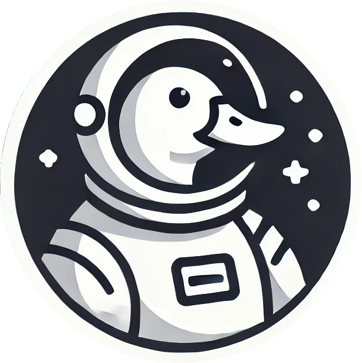

# ADA-Kosmos

<p align="center">
  
</p>

ADA-Kosmos is a full-stack application designed to visualize and analyze crypto token data on the Cardano blockchain. It offers real-time analytics, interactive 3D graphs, and comprehensive wallet exploration.

## Table of Contents

- [Overview](#overview)
- [Features](#features)
- [Project Structure](#project-structure)
- [Problem Statement](#problem-statement)
- [Technical Architecture](#technical-architecture)
- [Implementation Details](#implementation-details)
- [Roadmap](#roadmap)
- [Research Applications](#research-applications)

## Overview

ADA-Kosmos (also known as ADA Kosmos) is a data visualization platform for the Cardano blockchain ecosystem. It uses graph visualization and market data to create interactive visuals that show relationships between tokens, wallets, and market trends that aren't visible in standard data formats.

## Features

- **Real-Time Visualization:** Interactive 3D graphs powered by [`TokensGraphClient`](frontend/app/(app)/dashboard/components/TokensGraphClient.tsx).
- **Market Analytics:** Displays token liquidity, price, and market capitalization using services like [`MarketTokensApiService`](frontend/services/MarketTokensApiService.ts).
- **Wallet Explorer:** Explore on-chain wallet data with dynamic UI components (e.g. [`WalletExplorer`](frontend/components/sidebar/walletExplorer/walletExplorer.tsx)).
- **Robust API Integration:** Implements a consistent API contract using TypeScript interfaces and generics.

## Project Structure
### Backend

- **Language:** C++ with CMake for build management.
- **Responsibilities:**
  - Fetching and processing token data (see [`topLiquidityTokens.cpp`](backend/src/requests/topLiquidityTokens.cpp) and [`tokenPriceOHLCV.cpp`](backend/src/requests/tokenPriceOHLCV.cpp)).
  - Generating graph datasets (see [`computatuions.cpp`](backend/src/data/computations.cpp))
- **Dependencies:** libcurl, nlohmann-json.
- **Configuration:** API keys should be placed in the `.key` file located inside the backend directory.
- **Documentation:** See [Backend README](backend/README.md) for detailed setup and development instructions.

### Frontend
- **Framework:** Next.js & React.
- **Responsibilities:**
  - Providing an interactive dashboard.
  - Managing API calls and state using services like [`MarketTokensApiService`](frontend/services/MarketTokensApiService.ts) and context providers (see [`SelectedTokenContext`](frontend/contexts/SelectedTokenContext.tsx)).
- **Visualization:** Utilizes 3D force-directed graphs for token visualization ([`FocusGraph`](frontend/app/(app)/dashboard/components/FocusGraph.tsx)).
- **Documentation:** See [Frontend README](frontend/README.MD) for detailed setup and development instructions.

## Problem Statement

The Cardano ecosystem generates large amounts of complex data that's hard to understand through traditional means:

- **Data Overload:** The volume of token data, transactions, and market movements creates information overload that standard dashboards can't present clearly.
- **Hidden Relationships:** Important relationships between tokens, such as price correlations, liquidity pools, and shared holder bases, aren't visible in typical market data.
- **Fragmented Information:** Relevant data is spread across multiple platforms, forcing users to switch between different services.
- **Accessibility Barriers:** Technical expertise is often needed to access and interpret on-chain data, creating obstacles for casual users.
- **Structural Insights Gap:** There's a lack of tools that show the underlying structural relationships in the Cardano ecosystem.

## Technical Architecture

### Frontend Architecture
- Framework: Next.js with React for UI development
- Visualization: Three.js and Force-Graph libraries
- Styling: Tailwind CSS with Shadcn UI
- Authentication: Clerk
- State Management: React Context API

### Backend Architecture
- API Integration: Custom proxy service
- Data Processing: Token correlation and metrics services
- Caching: Redis-based caching via Upstash
- Data Sources: TapTools API integration

### Data Pipeline
- Data Collection from on-chain sources
- Processing for correlations and metrics
- Transformation for visualization
- Caching for performance optimization

## Implementation Details

### Solar System View
- ADA centered as the sun
- Top 10 Cardano tokens as orbiting planets
- Size represents market cap
- Color coding for price changes
- Detailed token information on selection

### Correlation Graph
- 3D visualization of 100 token relationships
- Node size shows liquidity
- Link thickness represents correlation strength
- Adjustable correlation thresholds
- Detailed metrics on selection

### Wallet Explorer
- Wallet visualization as spacecraft
- Portfolio breakdown
- Performance tracking
- NFT holdings display
- Liquidity position analysis

## Roadmap

### Phase 1: Core Platform (Current)
- Solar System View
- Correlation Graph
- Wallet Explorer
- Token Swap integration

### Phase 2: Enhanced Monitoring (Q2 2025)
- Whale Activity Tracking
- Real-time alerts
- Enhanced wallet tracking
- Portfolio analysis

### Phase 3: Advanced Analytics (Q3 2025)
- Price movement models
- Pattern recognition
- Anomaly detection
- API access

### Phase 4: Community Features (Q4 2025)
- User profiles
- Sharing capabilities
- Community analysis
- Social integration

### Phase 5: Expanded Support (TBD)
- Multi-chain support
- Cross-chain analysis
- Ecosystem comparison tools

## Research Applications

ADA-Kosmos incorporates advanced research in:

- Topological data analysis for market structure
- Bubble detection using persistent homology
- Early warning systems for market corrections

Based on research from:
- [AIMS Mathematics, 2024](https://www.aimspress.com/article/doi/10.3934/math.2024045)
- [IEEE, 2020](https://ieeexplore.ieee.org/document/9250440)

© 2025 ADA-Kosmos Team

#### Backend:
- CMake (>=3.10)
- C++17 compatible compiler
- libcurl
- nlohmann-json

#### Frontend:
- Node.js (>=14)
- npm or yarn

### Steps

1. **Clone the repository:**
   ```bash
   git clone <your-repository-url>
   cd ADA-Kosmos

